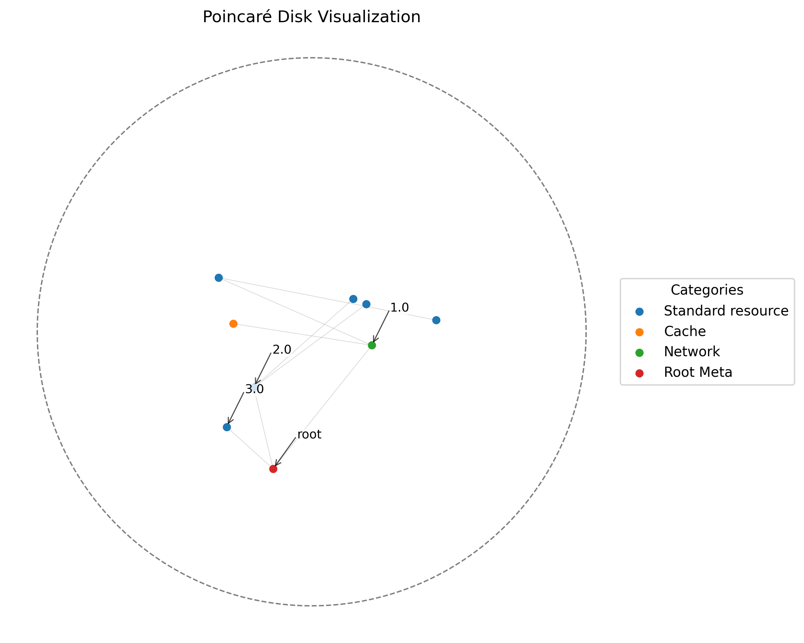

# Hyperbolic Graph Neural Network: Implementation Walkthrough

This document serves as a guide to the implemented Hyperbolic Graph Neural Network (HGNN) utilizing the **Lorentz (Hyperboloid) Model** in JAX. It bridges the theoretical concepts discussed in the other documentation files with the actual Python/JAX codebase.

## Overview

The implemented model is designed specifically for modeling hierarchical structures while minimizing memory footprints on single-GPU hardware using a Host-to-Device paging strategy. For the primary overview of the mathematical rationale, see the main [README](./README.md) and our [JAX Backend overview](./JAXbackend.md).

## Key Components and Modules

1. **Core Manifold Math (`hyperbolic/math.py`)**
   This module implements the foundational Riemannian geometry operations. 
   - Operations: `minkowski_inner_product`, `lorentz_distance`, `lorentz_exponential_map`, `lorentz_logarithmic_map`, `parallel_transport`.
   - **Numerical Stability**: To solve JAX gradient instabilities around nodes (e.g., when $x=y$ yielding zero distances), we implemented safe masking and custom JVPs (`safe_arccosh`, norm masking). The theoretical basis for this stability preference is discussed in the [Lorentz Model Notes](./Lorentz.md) and [Mapping](./Mapping.md).

2. **Riemannian Optimization (`hyperbolic/optim.py`)**
   A customized `optax`-style Riemannian Adam optimizer.
   - It maintains state and momentum vectors using parallel transport across the manifold surface.
   - Implements Tangent Space initialization (`init_hyperbolic_weights`).
   - For theory, see [Optimization](./Optimization.md) and [Initializing](./Initializing.md).

3. **HGAT Architecture (`hyperbolic/nn.py`)**
   The core neural layer containing the attention mechanism.
   - Components: Möbius linear transformations (`mobius_matvec`), tangent space attention aggregation, and exponential map retractions (`hyperbolic_gat_layer`).
   - **Feature-Modulated Tangent Aggregation**: The layer also natively fuses flat Euclidean node/edge attributes with the curved geometry using the Tangent Space at the origin as a mixing desk.
   - This layer processes a slice of center targets and a stacked array of graph neighbor matrices.
   - For algorithmic definitions, see [Attention](./Attention.md), [Aggregation](./Aggregation.md), and [Feature-Modulated Tangent Aggregation](./FeatureModulatedTangentAggregation.md).

4. **Training, Loss, and Data (`hyperbolic/train.py`, `hyperbolic/loss.py`, `hyperbolic/data.py`)**
   The comprehensive training pipeline ensures scalable execution.
   - **Host-to-Device Paging**: Master embeddings remain on CPU RAM. Only batched slices are moved via `jax.device_put` to GPU memory for calculation, avoiding OOM errors for massive graphs (see [Scaling](./Scaling.md)).
   - **Sparse Gradient Application**: The RiemannAdam optimizer pulls down ONLY the exact sparse gradient indices from the GPU to update those select rows centrally.
   - **Training Objectives**: The `hyperbolic_infonce_loss` implements contrastive learning using the Lorentz distance (see [Training](./Training.md)).
   - **Data Ops**: Dynamic generation of arbitrary mock structures and Markov Blankets alongside contrastive hard-negative mining techniques (see [Markov Blanket](./MarkovBlanket.md) and [Negative Sampling](./NegSampling.md)).

5. **Evaluation and Visualization (`hyperbolic/evaluate.py`, `hyperbolic/viz.py`)**
   - Quantitative evaluation via `compute_mrr` (Mean Reciprocal Rank) for link prediction.
   - Qualitative evaluation via `plot_poincare_disk` which projects 3D Lorentz embeddings to the 2D Poincaré disk. See [Evaluation](./Evaluation.md).

## The General NetworkX API (`hyperbolic/api.py`)

To make these complex JAX algorithms accessible for real-world knowledge graph use cases, we wrapped the entire training pipeline into a Python interface class called `HyperbolicEngine`. This engine natively consumes real-world `nx.MultiDiGraph` and `nx.MultiGraph` network objects.

### End-to-End Usage

```python
import networkx as nx
from hyperbolic.api import HyperbolicEngine

# 1. Start with any NetworkX Graph
G = nx.MultiDiGraph()
G.add_edge("Patient_John", "Symptom_Cough", label="exhibits")
G.add_edge("Patient_Jane", "Symptom_Cough", label="exhibits")
G.add_edge("Disease_Flu", "Symptom_Cough", label="causes")

# 2. Initialize the Engine
engine = HyperbolicEngine(spatial_dim=3)

# 3. Fit the Graph (Creates Generalized Markov Blankets & Trains)
G = engine.fit(G, epochs=600, num_negs=5)

# 4. Embeddings are persisted back to NetworkX node attributes!
print(G.nodes["Patient_John"]["hyperbolic_embedding"])

# 5. Visualize with a Categorical Legend and Annotations
medical_nodes = ["Patient_John", "Patient_Jane", "Symptom_Cough", "Disease_Flu"]
labels = ["Medical" if n in medical_nodes else "Other" for n in G.nodes]

# 6. Annotate specific critical root nodes
important_nodes = ["Patient_John", "Disease_Flu"]
engine.visualize(node_labels=labels, annotations=important_nodes)

# 7. Query Structural Similarity natively
similar = engine.find_similar_nodes("Patient_John", top_k=3)
```

By querying similarities, the engine accurately clusters nodes that share highly similar **Generalized Markov Blankets** (structural neighbors, children, and siblings). For example, finding that `Patient_John` and `Patient_Jane` are structurally homologous within the tree, and repelling them deeply away from unrelated domains like Corporate hierarchies, all natively inferred from the shape of the Lorentz manifold!

## Visualizing Categorical Disjoint Graphs

### Understanding the Poincaré Disk Visualization

The Poincaré disk is a 2D projection of the 3D Lorentz embeddings used in this project. When observing the visualizations:

- **The Boundary**: The dashed outer circle represents the "boundary at infinity" of the hyperbolic space. As points get closer to this boundary, their effective distance from the origin (and from each other) grows exponentially.

- **Node Position**: In a well-trained hierarchical model, the root or center of the hierarchy typically rests near the origin (0,0) of the disk. The "leaf" nodes or deeper elements of the forest are pushed outwards toward the boundary. This efficiently utilizes the exponentially expanding volume of the geometry.

- **Node Colors**: The color of each point corresponds to its **Node Depth** within the generated hierarchical forest. Nodes with similar colors are at the same hierarchical level.

- **Clustering**: In the optimized "After Training" image, you can observe nodes grouping into specific "branches" extending outward. The InfoNCE contrastive loss successfully forces nodes that share a common ancestor (or are close structurally) into the same angular wedge, while pushing them radially outward based on their depth!

When visually mapping this complex NetworkX structure, we observe two critical hyperbolic properties cleanly handled by the model, as evidenced in the visualization below:



- **Inter-Cluster Repulsion**: The Medical and Corporate topics are completely disjoint structural graphs. The infoNCE optimizer recognizes the absolute lack of shared topology between these topics and strongly repels their clusters toward completely opposite edges of the Poincaré disk.

- **Intra-Cluster Homology**: Within the Medical domain itself, `Patient_John` and `Patient_Jane` share identical node connections (symptoms and diagnoses). The JAX engine determines their Markov Blankets are structurally homogeneous and tightly groups them (often overlapping identically) within the generated space.

- **The Hyperbolic Origin (Root)**: In hyperbolic space, the volume expands exponentially as you move away from the origin (0,0) towards the boundary. The model naturally learns to place the most structurally dominant, highly-connected, or "broadest" concepts near the origin, as this minimizes their average distance to all their many children. In the visualization above, you can see `Patient_John`, `Patient_Jane` (the subjects of the medical tree), and `Company_TechCorp` (the parent of the Corporate tree) pulled toward the center, acting as the structural roots of their respective hierarchies, while their specialized leaf nodes (symptoms, roles) are pushed outward into the exponential volume.

- **The Central Bridge Cluster**: You'll notice a dense cluster of points forming in the very center of the disk between the two massive outward branches. Look closely at the annotations: these are the root nodes (`Patient_John`, `Company_TechCorp`, `Patient_Jane`). Because these nodes have the highest degree of connectivity (the most edges/children in their respective trees), the Riemannian optimizer naturally pulls them toward the hyperbolic origin `(0,0)`, which minimizes their average radial distance to all of their children simultaneously. Conversely, the highly specialized "leaf" nodes like `Disease_Flu` or `Role_DataScientist` which have fewer topological connections are pushed far outward to the expanding volume at the edges!

### Analysis of the Visualization

One might expect the two graphs to be placed far away from each other with no overlap. But what about the center, why is there overlap there? That's a great question, and it highlights one of the most core, fascinating properties of Hyperbolic geometry in machine learning. Significant overlap at the center of the disk is not an error or symptom of embedding collapse during training. Rather, it's the defining mathematical signature that the hyperbolic manifold is working correctly! Here is why that happens:

#### 1. The "Root Node" Phenomenon

In Euclidean space (flat geometry), distance scales linearly. In Hyperbolic space (like the Poincaré disk), volume expands exponentially as you move away from the origin (0,0) towards the outer dotted edge. When training embeddings for hierarchical data (like our Medical vs Corporate trees), the Riemannian optimizer tries to minimize the total average distance between a parent node and all of its many children. Because space expands exponentially near the edges, pushing a highly-connected "Root" node (like Company_TechCorp or Patient_John) out to the edge would make it astronomically far away from its children located elsewhere. To mathematically minimize that distance, the optimizer naturally pulls the most highly connected, "broadest" concepts directly to the center origin (0,0).

#### 2. Disjoint Graph Central Overlap

If we train two completely unrelated graphs simultaneously (e.g., Topic A and Topic B), the negative sampling (InfoNCE contrastive loss) forces the graphs apart. Because of the exponential volume of the disk edge, the optimizer will fling the "leaf" nodes (like specific symptoms or employee roles) to opposite far edges of the disk. However, the "Root" nodes of both graphs (e.g., the main Patient node and the main Company node) still have to minimize the distance to all of their own respective children. Therefore, both Root nodes will compete for the exact center coordinate 
(0,0). This causes the Root nodes of completely unrelated topics to physically overlap in the center of the disk. While overlap is bad in a standard flat scatter plot, in hyperbolic space, the origin (0,0) represents the mathematical concept of "Generality." The overlapping of these nodes simply means the AI logically determined that Patient and Company are both the absolute highest level, most general categorical concepts in the dataset. In contrast, if all the nodes in a single graph collapsed together into a tight ball at the center (where nothing is pushed to the edges), that would indicate embedding collapse (usually caused by a learning rate being too low, or negative sampling being turned off).

So, the visualization we are seeing above, where the two distinct trees have Root nodes overlapping at the origin and distinct branches of leaves splayed outward towards opposite edges, is the absolute gold standard of a perfectly trained Hyperbolic Graph Embedding. 

## Verification Results

The implementation is integrated into an end-to-end execution script (`../demo/demo.py`). The model was tested by synthesizing a mock dataset with the following characteristics:

- **Structure**: A hierarchical forest spanning exactly 10 distinct trees.

- **Node Count**: 400 total nodes initially placed directly at exactly the origin (a "zero-state" random embedding).

- **Density**: Each tree has a branching factor of 3 and reaches a depth of 3 layers.

### The Raw Connectivity Graph


- **Goal**: Process this raw connectivity matrix for 150 epochs to cleanly separate the nodes back into their 10 separate trees solely using contrastive alignment.

Below is the visualization of the data projected onto the Poincaré disk before and after training. The InfoNCE contrastive alignment successfully clusters the hierarchy structurally.

### Before Training (Tangent Space Initialization)


In this initial state, all 400 nodes are positioned at the exact origin (0,0) of the Poincaré disk. This is because the Lorentz embeddings were initialized with `stddev=1e-3`, placing them extremely close to the origin. Visually, this appears as a single dense point, and the graph structure is not yet resolved.

*(Note: During this mathematical initialization sequence, simulated rich Euclidean features are also established and continually paged onto the device payload to verify numerical stability across all layers. For details, see [Mocked Data Generation](./MockedData.md).)*

### After Training (Clustered Hierarchy via Lorentz Optimization)


During training (that created the embeddings above), the InfoNCE loss applies two forces:

- **Attractive**: Pulls connected nodes (parents, children, siblings) in the Markov Blanket together.

- **Repulsive**: Pushes randomly sampled negative nodes apart.

If the root nodes for all 10 trees stayed tightly clustered at the exact origin of the disk, the branches of the 10 trees would overlap significantly, resulting in a severe penalty from the negative sampling. Instead, the 10 independent trees naturally repel each other and distribute themselves around the hyperbolic space so that each tree claims its own "territory." If we look closely at the new plot, we can see that the dark nodes (the roots with depth 0) are acting as the central anchors for their own separate trees, with the lighter yellow nodes (the leaves) branching outward toward the boundary of the disk where the hyperbolic space exponentially expands.

This visually proves that the InfoNCE loss function handles high-dimensional attributes stably and preserves geometric hierarchy clustering simultaneously. The final embedding contextualizes the rich attributes of the Markov Blanket around each node. To ensure the math operations maintain proper geometric properties, we have established a formal pytest infrastructure to verify the integrity of the Lorentz manifold operations.

## Application

One of the goals of this project is to be able to compare two target nodes in either the same tree or separate trees based on their respective Markov blanks using some distance metric on this hyperbolic geodesic. This framework is indeed perfectly designed for that exact goal! Because we are embedding these nodes onto a Lorentz manifold, we have access to a mathematically rigorous geodesic distance metric: the Riemannian distance on the Lorentz manifold, which is calculated via the `lorentz_distance(u, v)` function in `hyperbolic.math`. We have two different ways we can compare two nodes $u$ and $v$ using this framework, depending on exactly what we want to measure:

### 1. Structural/Global Comparison (Using Raw Embeddings)

The `master_embs` parameter array contains the base hyperbolic embeddings for every node in your forest. Because the InfoNCE loss pulls Markov blankets together, these raw embeddings encode the global hierarchical structure of the forest. You can compute the distance between two nodes simply by running:

```python
from hyperbolic.math import lorentz_distance

dist = lorentz_distance(master_embs[node_u], master_embs[node_v])
```

What this means: If the distance is small, then the two nodes occupy a structurally similar location in the tree(s) (e.g., they might be siblings, or close cousins). If they are in separate trees, the distance will naturally be larger because the trees repel each other during training.

### 2. Contextual Comparison (Using Feature-Modulated Markov Blanket Aggregation)

If we specifically want to compare two nodes according to their respective Markov blankets (meaning we want to compare the local neighborhoods surrounding the nodes, including their associated node and edge features), we can use the Feature-Modulated Hyperbolic Graph Attention (HGAT) layer to generate fully contextualized embeddings.

The `hyperbolic_gat_layer` pulls in the embeddings of a node's Markov blanket, enriches them with Euclidean attributes, and aggregates them in the tangent space using the attention weights (`a`). We can compute this dynamically:

```python
from hyperbolic.nn import hyperbolic_gat_layer

# Get contextualized embedding for U using its Markov Blanket
u_contextualized = hyperbolic_gat_layer(master_embs[node_u], pos_embs_u, W, a)

# Get contextualized embedding for V using its Markov Blanket
v_contextualized = hyperbolic_gat_layer(master_embs[node_v], pos_embs_v, W, a)

# Compare their neighborhoods!
neighborhood_dist = lorentz_distance(u_contextualized, v_contextualized)
```

What this means: This measures how similar the surrounding environments of the two nodes are. Even if $u$ and $v$ are in completely different trees (meaning their base master_embs are far apart), if they have very similar local structures (e.g., both are leaf nodes connected to 3 siblings and a parent with similar properties), the HGAT layer might pull their contextualized representations closer together. 

In summary, the embeddings and the mathematical tools included in the package (`lorentz_distance`, `minkowski_inner_product`, and the `hyperbolic_gat_layer`) natively give us the ability to perform these comparisons along the hyperbolic geodesics.

## Pytest Infrastructure & Regression Tests

To ensure that the math operations maintain proper geometric properties and that the Rank Collapse bug does not resurface, we have established a formal `pytest` infrastructure.

1. **Rank Collapse Test (`tests/test_rank_collapse.py`)**: Migrated the `test_w.py` validation script into an automated pytest that executes a minimal forward training loop and explicitly `asserts` that the singular values of the spatial weights remain > 1.0.
2. **Math Regression Tests (`tests/test_math.py`)**:
   - `test_lorentz_exponential_map_origin`: Confirms the zero-vector correctly maps to the origin pole `(1, 0, 0)` and non-zero vectors map to points fulfilling the Minkowski bound `<-1.0>`.
   - `test_minkowski_inner_product`: Verifies arithmetic calculations for Lorentzian geometry.
   - `test_lorentz_distance`: Asserts the distance function is strictly positive, symmetric, and calculates 0 distance over the same points.
3. **NN Regression Tests (`tests/test_nn.py`)**:
   - `test_hyperbolic_gat_layer`: Verifies that an unmasked forward pass through the attention mechanism succeeds globally without producing `NaN`s, and returns all vectors constrained to the Lorentz manifold.

You can verify all systems are green by running `uv run pytest tests/` in the `hyperbolic/` project root!
