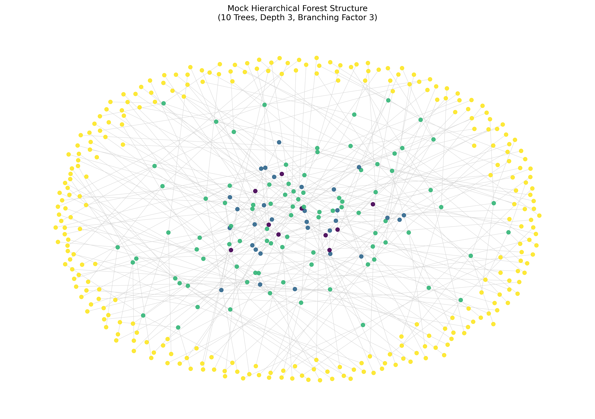
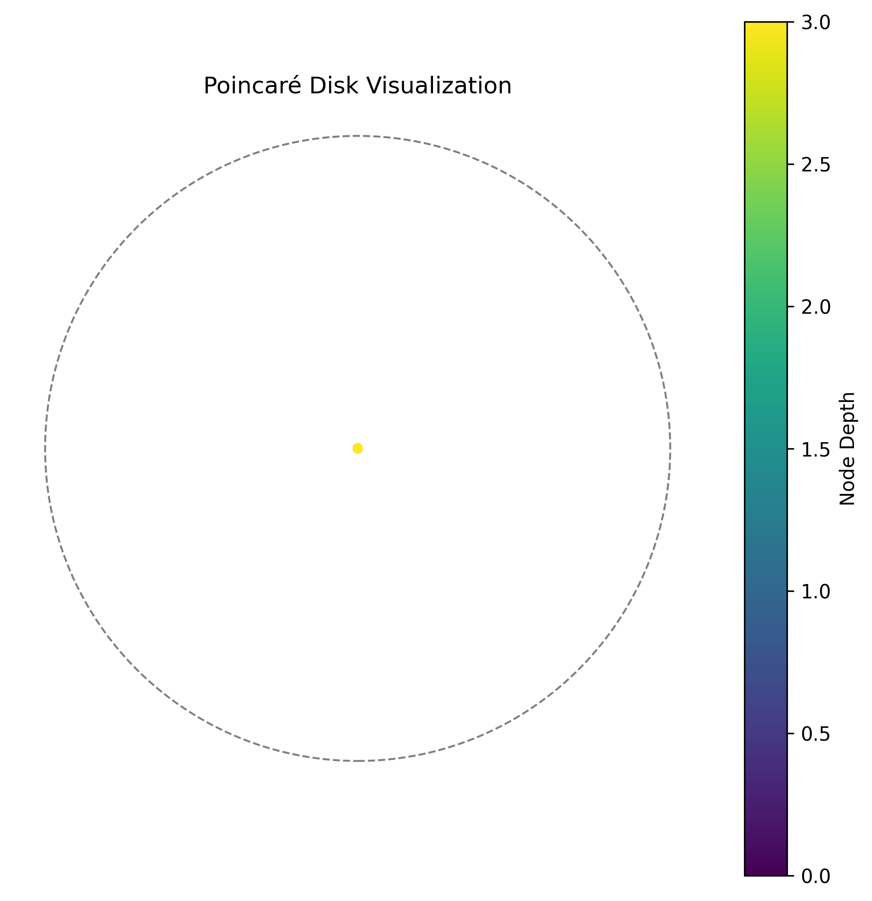
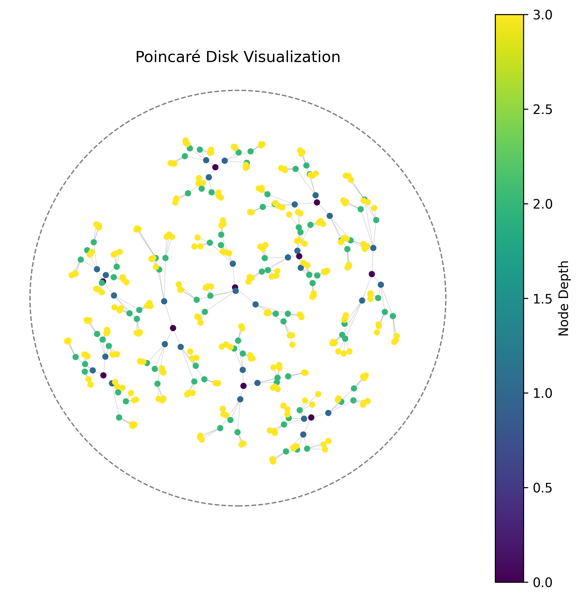

# Hyperbolic Graph Neural Network: Implementation Walkthrough

This document serves as a guide to the implemented Hyperbolic Graph Neural Network (HGNN) utilizing the **Lorentz (Hyperboloid) Model** in JAX. It bridges the theoretical concepts discussed in the other documentation files with the actual Python/JAX codebase.

## Overview

The implemented model is designed specifically for modeling hierarchical structures while minimizing memory footprints on single-GPU hardware using a Host-to-Device paging strategy. For the primary overview of the mathematical rationale, see the main [README](./README.md) and our [JAX Backend overview](./JAXbackend.md).

## Key Components and Modules

1. **Core Manifold Math (`hyperbolic/math.py`)**
   This module implements the foundational Riemannian geometry operations. 
   - Operations: `minkowski_inner_product`, `lorentz_distance`, `lorentz_exponential_map`, `lorentz_logarithmic_map`, `parallel_transport`.
   - **Numerical Stability**: To solve JAX gradient instabilities around nodes (e.g., when $x=y$ yielding zero distances), we implemented safe masking and custom JVPs (`safe_arccosh`, norm masking). The theoretical basis for this stability preference is discussed in the [Lorentz Model Notes](./Lorentz.md) and [Mapping](./Mapping.md).

2. **Riemannian Optimization (`hyperbolic/optim.py`)**
   A customized `optax`-style Riemannian Adam optimizer.
   - It maintains state and momentum vectors using parallel transport across the manifold surface.
   - Implements Tangent Space initialization (`init_hyperbolic_weights`).
   - For theory, see [Optimization](./Optimization.md) and [Initializing](./Initializing.md).

3. **HGAT Architecture (`hyperbolic/nn.py`)**
   The core neural layer containing the attention mechanism.
   - Components: Möbius linear transformations (`mobius_matvec`), tangent space attention aggregation, and exponential map retractions (`hyperbolic_gat_layer`).
   - This layer processes a slice of center targets and a stacked array of graph neighbor matrices.
   - For algorithmic definitions, see [Attention](./Attention.md) and [Aggregation](./Aggregation.md).

4. **Training, Loss, and Data (`hyperbolic/train.py`, `hyperbolic/loss.py`, `hyperbolic/data.py`)**
   The comprehensive training pipeline ensures scalable execution.
   - **Host-to-Device Paging**: Master embeddings remain on CPU RAM. Only batched slices are moved via `jax.device_put` to GPU memory for calculation, avoiding OOM errors for massive graphs (see [Scaling](./Scaling.md)).
   - **Sparse Gradient Application**: The RiemannAdam optimizer pulls down ONLY the exact sparse gradient indices from the GPU to update those select rows centrally.
   - **Training Objectives**: The `hyperbolic_infonce_loss` implements contrastive learning using the Lorentz distance (see [Training](./Training.md)).
   - **Data Ops**: Dynamic generation of arbitrary mock structures and Markov Blankets alongside contrastive hard-negative mining techniques (see [Markov Blanket](./MarkovBlanket.md) and [Negative Sampling](./NegSampling.md)).

5. **Evaluation and Visualization (`hyperbolic/evaluate.py`, `hyperbolic/viz.py`)**
   - Quantitative evaluation via `compute_mrr` (Mean Reciprocal Rank) for link prediction.
   - Qualitative evaluation via `plot_poincare_disk` which projects 3D Lorentz embeddings to the 2D Poincaré disk. See [Evaluation](./Evaluation.md).

## Verification Results

The implementation is integrated into an end-to-end execution script (`../demo/demo.py`). The model was tested by synthesizing a mock dataset with the following characteristics:

- **Structure**: A hierarchical forest spanning exactly 10 distinct trees.

- **Node Count**: 400 total nodes initially placed directly at exactly the origin (a "zero-state" random embedding).

- **Density**: Each tree has a branching factor of 3 and reaches a depth of 3 layers.

### The Raw Connectivity Graph

- **Goal**: Process this raw connectivity matrix for 150 epochs to cleanly separate the nodes back into their 10 separate trees solely using contrastive alignment.

Below is the visualization of the data projected onto the Poincaré disk before and after training. The InfoNCE contrastive alignment successfully clusters the hierarchy structurally.

### Understanding the Poincaré Disk Visualization

The Poincaré disk is a 2D projection of the 3D Lorentz embeddings used in this project. When observing the visualizations:

- **The Boundary**: The dashed outer circle represents the "boundary at infinity" of the hyperbolic space. As points get closer to this boundary, their effective distance from the origin (and from each other) grows exponentially.

- **Node Position**: In a well-trained hierarchical model, the root or center of the hierarchy typically rests near the origin (0,0) of the disk. The "leaf" nodes or deeper elements of the forest are pushed outwards toward the boundary. This efficiently utilizes the exponentially expanding volume of the geometry.

- **Node Colors**: The color of each point corresponds to its **Node Depth** within the generated hierarchical forest. Nodes with similar colors are at the same hierarchical level.

- **Clustering**: In the optimized "After Training" image, you can observe nodes grouping into specific "branches" extending outward. The InfoNCE contrastive loss successfully forces nodes that share a common ancestor (or are close structurally) into the same angular wedge, while pushing them radially outward based on their depth!

### Before Training (Tangent Space Initialization)

### After Training (Clustered Hierarchy via Lorentz Optimization)

