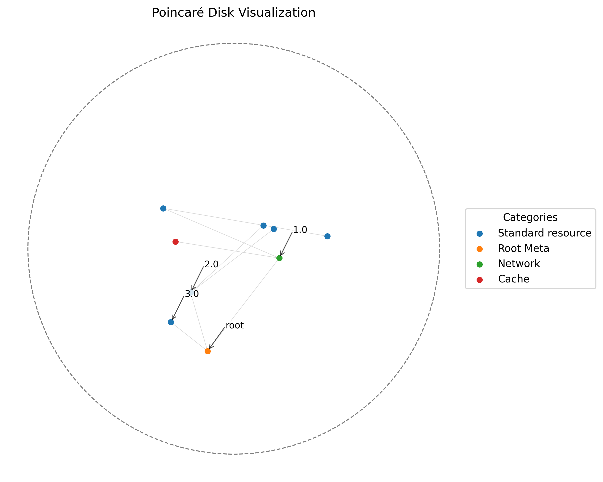

# The YAML Graph Interface

The `hyperbolic.interfaces.yaml_graph` module provides utilities for parsing nested YAML architectures into NetworkX directed graphs. This is particularly useful for modeling hierarchical taxonomies, organizational structures, and static component architectures as topological graphs.

## Core Features

- **Nested Key Preservation**: Reads unbounded layers of YAML arrays via the `contains` attribute.
- **Dynamic Identification**: If an explicit ID identifier is not provided (via `fulllevel` or `brlevel`), the parser automatically mints a UUID for the node.
- **Salt Collision Avoidance**: If multiple children provide the same identity parameters (e.g. duplicated levels in source data), the parser automatically appends an 8-hexadecimal salt to the duplicate node IDs to ensure NetworkX can map the distinct edges correctly instead of collapsing them.
- **Metadata Merging**: Top-level `metadata:` attributes are intercepted and merged directly into `G.graph` properties.

## Usage

```python
import networkx as nx
from hyperbolic.interfaces.yaml_graph import load_yaml_to_graph

# Parse a complex organizational YAML file
G = load_yaml_to_graph("data/my_architecture.yaml")

print(f"Parsed {G.number_of_nodes()} Nodes")
print(f"Graph Metadata: {G.graph}")

# Root children
root_connections = list(G.successors("root"))
```

## Example File Structure
The interface expects the following format:
```yaml
metadata:
  title: "Example Title"
rows:
  - name: "Parent Node"
    brlevel: "1.0"
    contains:
      - name: "Child Node"
        brlevel: "1.1"
```

## End-to-End Walkthrough

The `yaml_graph.py` parser is directly integrated into the main `api_demo.py` pipeline (utilizing the mock taxonomy found at `tests/data/test_generic_tree.yaml`). This provides users the ability to dynamically write hierarchical taxonomy files (like an organizational chart or infrastructure stack), parse them effortlessly, and instantly feed them into the `HyperbolicEngine` for manifold training.

The API Demo will take the parsed MultiDiGraph, automatically extract node relationships (Markov Blankets) via localized geometry without relying on explicit depth parameters, calculate hard negative contrasts across structural distances, and perform a host-to-device distributed stochastic Adam run across the Lorentz geometric plane to cluster taxonomically similar components together. 

The `api_demo.py` outputs the final clustered projection to the Poincaré unit disk as seen here, natively grouping elements like "Network" (such as `1.0`, API Gateway) and "Cache" components visually based purely on their structural adjacency configurations parsed from the original string YAML document.


